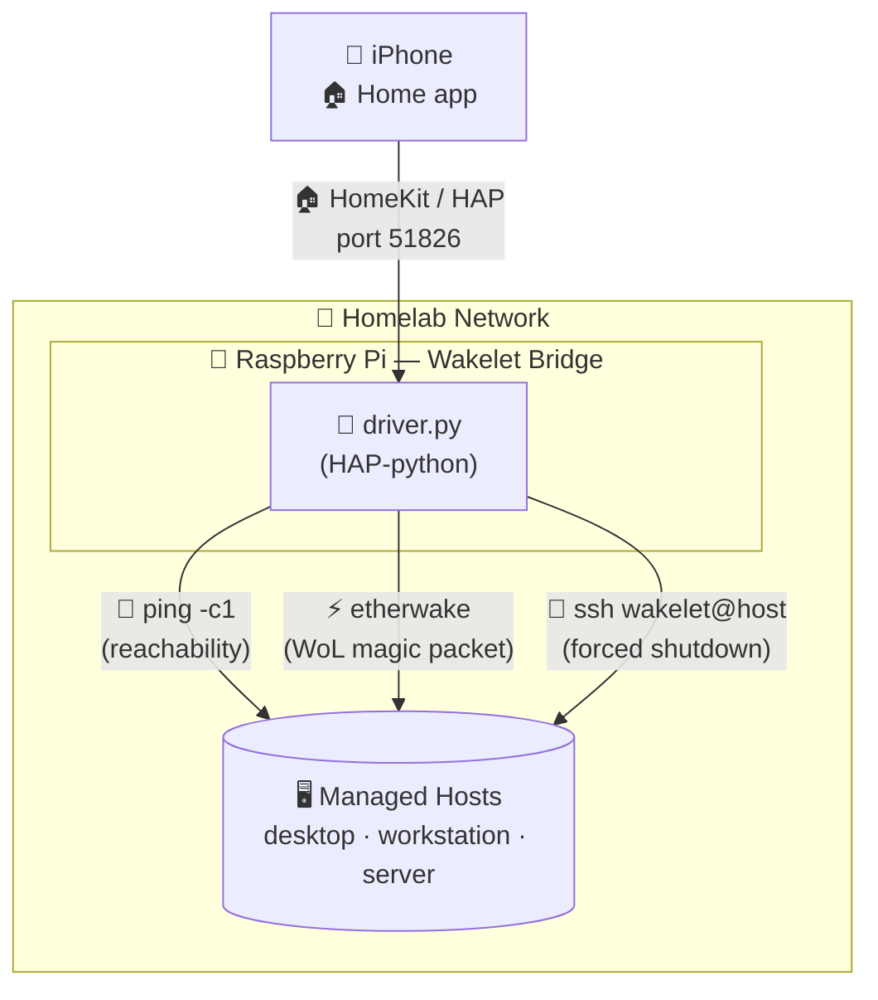

# Wakelet

A HomeKit IoT bridge for managing and controlling hosts on a local network. Hosts are exposed as HomeKit accessories, allowing you to wake and shut down machines directly from the Home app.

## Architecture



## Features

- **Wake** — send a Wake-on-LAN magic packet via `etherwake`
- **Shutdown** — SSH into a host and trigger a shutdown via a restricted `wakelet` user
- **Reachability** — periodically pings each host and reflects its online/offline state in HomeKit
- **Hosts** — configured via a simple `hosts.yaml` file

## Requirements

- Python 3.11+
- System tools on the bridge host:
  - `etherwake` (`apt install etherwake`)
  - `ssh` (`apt install openssh-client`)
  - `ping` (`apt install iputils-ping`)
- Python packages: see `requirements.txt`

---

## Bridge installation

The bridge runs as root to allow `etherwake` to send raw Ethernet frames without a sudoers entry.

### 1. Clone the repository

```bash
sudo git clone https://github.com/tlhakhan/wakelet.git /opt/wakelet
cd /opt/wakelet
```

### 2. Create and activate a virtual environment

```bash
python3 -m venv .venv
source .venv/bin/activate
```

### 3. Install Python dependencies

```bash
pip install -r requirements.txt
```

### 4. Install etherwake

```bash
sudo apt install etherwake
```

### 5. Configure hosts

```bash
cp docs/hosts.yaml /etc/wakelet/hosts.yaml
```

Edit `/etc/wakelet/hosts.yaml` to match your environment:

```yaml
hosts:
  - name: desktop.local
    mac: aa:bb:cc:dd:ee:ff
```

### 6. SSH key pair

The bridge automatically generates an Ed25519 SSH key pair on first startup at `/etc/wakelet/private/wakelet`. No manual key generation is needed.

After first startup, copy the public key to each target host:

```bash
cat /etc/wakelet/private/wakelet.pub
```

### 7. Install as a systemd service

```bash
sudo cp /opt/wakelet/docs/wakelet.service /etc/systemd/system/wakelet.service
sudo systemctl daemon-reload
sudo systemctl enable --now wakelet
```

Check status and logs:

```bash
sudo systemctl status wakelet
sudo journalctl -u wakelet -f
```

---

## Setting up target hosts for shutdown

Each host you want to shut down needs the `wakelet` SSH user configured with the bridge's public key. Run the setup script on each target host:

```bash
scp docs/authorize_wakelet_shutdown.sh user@target-host:~
scp /etc/wakelet/private/wakelet.pub user@target-host:~
ssh user@target-host "sudo bash authorize_wakelet_shutdown.sh ~/wakelet.pub"
```

`authorize_wakelet_shutdown.sh`:
1. Creates a locked `wakelet` user (no password login)
2. Adds a sudoers entry allowing `wakelet` to run `shutdown -h now`
3. Installs the public key in `authorized_keys` with a forced command — the key can only ever trigger a shutdown, nothing else

---

## Troubleshooting

### Wake-on-LAN not working

Wake-on-LAN requires configuration at two levels:

**1. BIOS / UEFI**

Enable Wake-on-LAN in the host's BIOS/UEFI settings. The option is typically found under *Power Management* and may be labelled *Wake on LAN*, *Power On By PCI-E*, or similar. This varies by motherboard.

**2. OS — netplan**

The network interface must have `wakeonlan: true` set. Example netplan config:

```yaml
network:
  version: 2
  ethernets:
    wired:
      match:
        name: "e[nt]*"
      dhcp4: true
      wakeonlan: true
```

**3. Verify with ethtool**

After applying the netplan config, confirm Wake-on-LAN is active on the interface:

```bash
sudo ethtool <interface> | grep -i wake
```

The output should show `Wake-on: g` (magic packet enabled). `Wake-on: d` means it is disabled.

---

## Running manually

```bash
cd /opt/wakelet
source .venv/bin/activate
python driver.py
```

All flags and their defaults:

| Flag | Default | Description |
|------|---------|-------------|
| `--state-file` | `/var/lib/wakelet/wakelet.state` | HAP pairing state file |
| `--private-dir` | `/etc/wakelet/private` | Directory for the SSH key pair |
| `--hosts-file` | `/etc/wakelet/hosts.yaml` | Hosts configuration file |
| `--authorized-user-name` | `wakelet` | SSH user on target hosts |

---

## Project structure

```
driver.py                Entry point — HomeKit bridge
services/
  hosts.py               Loads host records from hosts.yaml
  network.py             Interface detection and SSH key generation
docs/
  hosts.yaml             Example hosts configuration
  authorize_wakelet_shutdown.sh  Script to configure shutdown user on target hosts
  wakelet.service                systemd service unit file
  README.md              Deployment notes
```
